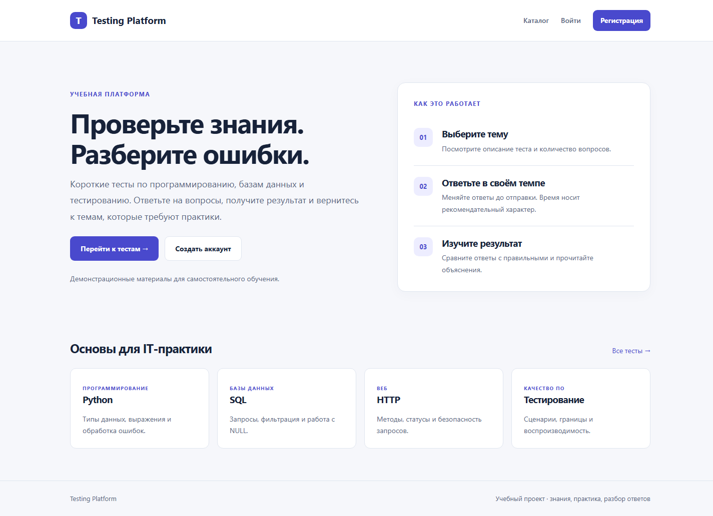
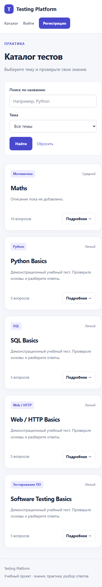
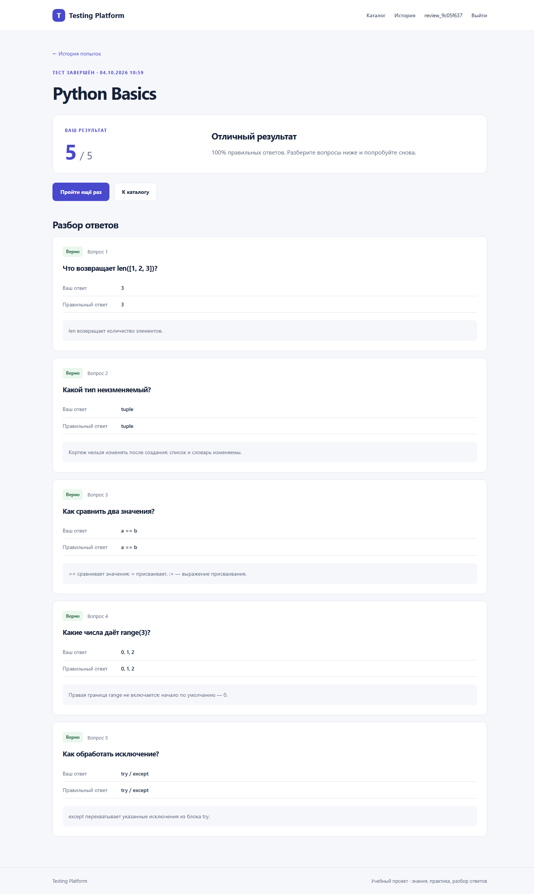

# Testing Platform

Учебная образовательная платформа для портфолио IT-стажёра. Пользователь выбирает тест, отвечает на вопросы и получает результат с объяснениями. Это самостоятельный Django-проект с SQLite и серверным HTML; REST API и внешние CDN не используются.

## Возможности

- Регистрация: username, обязательный email, пароль и повтор пароля. Новые email уникальны без учёта регистра и пробелов по краям; пароли хеширует Django.
- Стандартные вход, POST-выход и восстановление пароля Django. Безопасное перенаправление `next`, CSRF и проверка владельца результатов.
- Публичный каталог опубликованных тестов: поиск, темы, описания и количество вопросов; страница перед началом.
- Один правильный вариант; ответы можно менять до отправки. Прогресс через JavaScript, серверное предупреждение о пропусках. Основной сценарий работает без JavaScript.
- Серверный расчёт баллов, процент, объяснения, история с пагинацией, новое прохождение как отдельная попытка.
- Снимки вопросов, вариантов, выбранных и правильных ответов сохраняются вместе с результатом. Правка или удаление теста не меняет завершённый разбор.
- UUID черновика, уникальный UUID результата, транзакции SQLite IMMEDIATE: повторная/одновременная отправка не создаёт второй результат.
- Django Admin: темы-разделы, тесты, вопросы, варианты и результаты; inline-формы, фильтры, поиск и проверка публикации.
- Светлый адаптивный интерфейс с индиго-акцентом, системными шрифтами, клавиатурным фокусом, сообщениями и страницами 403/404/500.
- Команды резервного копирования и идемпотентной загрузки демонстрационных материалов.

## Стек и структура

Python 3.11+, Django 5.2.17 LTS, SQLite, HTML/CSS/JavaScript. Зависимости закреплены в `requirements.txt`; кроме Django установлены только его обязательные зависимости.

```text
DjangoProject1/       окружение, настройки и корневые URL
tasks/models.py      сохранённая основа Test → Topic → Question → Answer
 tasks/services.py   валидация вопросов и атомарная отправка попытки
 tasks/views.py      сценарии пользователя и проверка доступа
 tasks/admin.py      административные формы
 tasks/migrations/   исходные 0001–0007 + новые 0008 и 0009
 tasks/management/commands/  backup_db, seed_demo
frontend/templates/  общий базовый шаблон и страницы
frontend/static/     локальные CSS и JavaScript
scripts/dev.ps1      локальная настройка окружения
backups/             резервные копии SQLite, игнорируются Git
.local/              локальный секрет и журналы проверки, игнорируются Git
docs/                сценарии, отчёт и реальные снимки проверки
```

`Topic` сохранён как раздел конкретного теста. Поле `Test.topic` задаёт общую тему каталога (Python, SQL, Web, тестирование, а также прежние темы). Не ломается существующая иерархия и её внешние ключи.

## Быстрый запуск в Windows PowerShell

В текущем окружении `.venv` уже создана, зависимости установлены, миграции и демоданные применены. Для запуска:

```powershell
Set-Location 'C:\Users\nurma\Testing-platform'
Set-ExecutionPolicy -Scope Process -ExecutionPolicy Bypass
. .\scripts\dev.ps1
.\.venv\Scripts\python.exe manage.py runserver 127.0.0.1:8000
```

Политика выполнения меняется только в этом окне. Сценарий создаёт случайный локальный секрет в `.local/secret-key.txt`, сохраняет его между перезапусками и передаёт Django через переменную `SECRET_KEY`. Значения, которые вы уже задали в окружении, не перезаписываются. Это локальный сценарий, не конфигурация публикации.

Откройте:

- http://127.0.0.1:8000/ — главная;
- http://127.0.0.1:8000/tests/ — каталог;
- http://127.0.0.1:8000/register/ — новый аккаунт;
- http://127.0.0.1:8000/login/ — вход;
- http://127.0.0.1:8000/password-reset/ — восстановление;
- http://127.0.0.1:8000/history/ — свои попытки после входа;
- http://127.0.0.1:8000/admin/ — управление для администратора.

Старые маршруты `/tasks/…` также поддерживаются как отдельные совместимые псевдонимы. Основные ссылки ведут на корневые маршруты.

## Установка с нуля

В этом компьютере команда `python` указывает на MSYS Python без pip, а `py` не видит установку. Проверенный Windows Python:

```powershell
Set-Location 'C:\Users\nurma\Testing-platform'
$Python = 'C:\Users\nurma\AppData\Local\Programs\Python\Python311\python.exe'
& $Python -m venv .venv
.\.venv\Scripts\python.exe -m pip install -r requirements.txt
Set-ExecutionPolicy -Scope Process -ExecutionPolicy Bypass
. .\scripts\dev.ps1
.\.venv\Scripts\python.exe manage.py backup_db
.\.venv\Scripts\python.exe manage.py migrate
.\.venv\Scripts\python.exe manage.py seed_demo
.\.venv\Scripts\python.exe manage.py runserver 127.0.0.1:8000
```

На другом компьютере замените `$Python` на установленный Python 3.11+ либо используйте `py -3 -m venv .venv`, если Python Launcher его видит. Активация виртуального окружения не требуется: команды обращаются непосредственно к его python.exe.

## База и миграции

Существующую `db.sqlite3` **не удаляйте**. Перед любыми будущими миграциями выполните `backup_db`. Для самого первого запуска без базы команда корректно сообщает, что копия не нужна.

Исходные миграции 0001–0007 не изменены. В модели восстановлены поля из 0007: сложность, публикация, время, тема и дата обновления. Новая 0008 добавляет черновики, снимки ответов, историческое название и количество вопросов, UUID и ограничения; 0009 переносит название старого результата и защищает новые email от совпадений на уровне SQLite.

Резервная копия до изменений находится в `backups/db-before-portfolio-20261004-015125.sqlite3`. После миграции и заполнения сверены все исходные поля: сохранены 8 аккаунтов, 3 теста, 10 разделов, 10 вопросов, 30 вариантов и 9 результатов. Никакие пользовательские строки не удалялись.

У старых результатов нет сохранённых ответов и общего числа вопросов. Интерфейс показывает исходный балл и прямо сообщает, что процент достоверно восстановить нельзя. Новые попытки сохраняют полный снимок.

В исходной базе обнаружена одна группа повторяющихся непустых email. Старые адреса оставлены без изменения; SQLite-триггеры и форма не допускают новых конфликтов. Стандартное восстановление Django обрабатывает каждый активный старый аккаунт с таким адресом. Администратору следует согласовать индивидуальные адреса с владельцами через Admin; автоматического переименования и удаления аккаунтов нет.

## Демонстрационные тесты

```powershell
.\.venv\Scripts\python.exe manage.py seed_demo
```

Создаёт Python Basics, SQL Basics, Web / HTTP Basics и Software Testing Basics — по 5 вопросов с минимум двумя вариантами и объяснениями. На страницах материал помечен как демонстрационный. Ключ `demo_key` уникален: повторная команда не создаёт дубликаты и не перезаписывает ручные правки. Исходные тесты также сохраняются.

## Создание администратора и подготовка теста

```powershell
.\.venv\Scripts\python.exe manage.py createsuperuser
```

Задайте собственный username, email и пароль в приглашениях команды. Предустановленного администратора и известного пароля нет.

1. Сохраните новый тест как черновик: флаг «Опубликован» выключен.
2. Добавьте разделы в форме теста. Перейдите по ссылке изменения раздела и добавьте вопросы inline.
3. Откройте вопрос и добавьте варианты с единственным правильным, а также объяснение.
4. Вернитесь к тесту и включите публикацию. Пустой или некорректный тест не публикуется.
5. Для добавления, удаления и перемещения структуры сначала снимите публикацию. Для изменения вариантов опубликованного вопроса inline проверяет минимум два варианта и ровно один правильный ответ.

Даже если некорректные данные появились через SQL/ORM, сервер не разрешит начать/отправить такой тест. Изменение вопросов во время прохождения потребует начать новую попытку; уже завершённые результаты сохраняются. Результаты доступны в Admin только для просмотра.

## Восстановление пароля и SMTP

По умолчанию используется **console email backend**. В форме `/password-reset/` введите адрес зарегистрированного аккаунта. Полный текст письма и настоящая одноразовая ссылка появятся **в терминале, где работает runserver**. Письмо не доставляется в реальный почтовый ящик. Откройте эту ссылку, задайте новый пароль и войдите. Ссылка действует один час и перестаёт работать после смены пароля. Не публикуйте терминальные журналы со ссылками сброса.

Для неизвестного email показывается такое же нейтральное подтверждение, без раскрытия наличия аккаунта. Аккаунтам без email нужно сначала указать адрес через администратора; отсутствие адреса не мешает прежнему входу.

Настройки читаются из переменных окружения, `.env.example` — только пример, сам `.env` автоматически не загружается. Для реального SMTP перед запуском сервера:

```powershell
$env:EMAIL_BACKEND = 'django.core.mail.backends.smtp.EmailBackend'
$env:EMAIL_HOST = 'smtp.your-provider.example'
$env:EMAIL_PORT = '587'
$env:EMAIL_HOST_USER = 'your-account@example.com'
$env:EMAIL_USE_TLS = '1'
$env:EMAIL_USE_SSL = '0'
$env:DEFAULT_FROM_EMAIL = 'your-account@example.com'
$credential = Get-Credential -UserName $env:EMAIL_HOST_USER -Message 'Пароль приложения SMTP'
$env:EMAIL_HOST_PASSWORD = $credential.GetNetworkCredential().Password
```

Замените примерные адреса настройками провайдера. Для implicit TLS на 465 выставьте `EMAIL_USE_TLS=0`, `EMAIL_USE_SSL=1`. Пароль хранится только в окружении процесса, не в репозитории. Реальная SMTP-доставка в проверках **не выполнялась**. Внешние сервисы и платные интеграции не подключались.

## Проверки

```powershell
Set-ExecutionPolicy -Scope Process -ExecutionPolicy Bypass
. .\scripts\dev.ps1
$env:PYTHONDONTWRITEBYTECODE = '1'
$env:TEST_DB_PATH = Join-Path (Get-Location).Path '.local\test-portfolio.sqlite3'
.\.venv\Scripts\python.exe -m pip check
.\.venv\Scripts\python.exe manage.py check
.\.venv\Scripts\python.exe manage.py makemigrations --check --dry-run
.\.venv\Scripts\python.exe manage.py test --noinput
```

`TEST_DB_PATH` — отдельная **одноразовая тестовая база**, её создаёт и удаляет Django Test Runner. Не указывайте рабочую `db.sqlite3`: тестовая база очищается. Файловая тестовая база используется для проверки одновременных SQLite-запросов; у in-memory SQLite иное поведение блокировок.

Подробности фактически выполненных проверок: [отчёт](docs/implementation-report.md). [Тест-кейсы](docs/test-cases.md) и [ручной чек-лист](docs/manual-testing.md) отдельно отмечают автоматизированные, выполненные браузерные и запланированные ручные проверки.

## Ограничения

- Учебная локальная система, не сертификационный экзамен: нет прокторинга, адаптивного тестирования и контроля таймера; `time_limit` — ориентир.
- До 100 вопросов на тест; черновик действует 12 часов. Очистка старых черновиков не автоматизирована.
- SQLite пригодна для небольшого локального проекта; IMMEDIATE-транзакции сериализуют запись, не рассчитаны на большой поток пользователей.
- Нет подтверждения email, смены email пользователем и защиты от массового перебора/рассылки. Для публичной эксплуатации потребуется отдельное ограничение запросов.
- Публикация/развёртывание не выполнялись. HTTPS, production-статические файлы, настройки прокси и доставка SMTP остаются задачами отдельного окружения. При DEBUG=0 secure cookies требуют HTTPS.
- `.gitignore` исключает новые секреты, окружение, копии и локальные данные. Исходный репозиторий уже отслеживал SQLite и несколько pyc; ничего не удалено из Git-индекса и коммит не создан. Перед будущей публикацией следует отдельно исключить рабочую SQLite и старые кеши из индекса, сохранив локальные файлы.

## Реальные снимки интерфейса

Снимки сделаны в Edge Headless на 1440 и 390 px, на отдельной копии базы с демонстрационным аккаунтом; пользовательская база при браузерном тесте не менялась.




